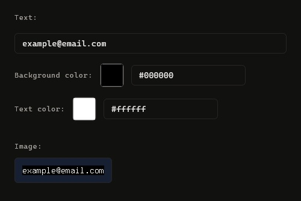

# Text to image tool

A simple web UI tool for converting a text input into a PNG image. Supports custom background and text color inputs via a color picker or a hex code. Offers a live image preview that updates as you type or change colors. 

Usage idea: display your email address on a website while obfuscating it
from pesky crawlers and bots!

## Credits

Based on the [Email to Image](https://www.daftlogic.com/projects-email-to-image.htm) tool and PHP code by DaftLogic. Extended with Docker deployment, live
image preview, custom color inputs, and general text input support.

## Usage

A live version of this tool is available at [https://text-to-image.tonykuosa.com/](https://text-to-image.tonykuosa.com/).

### Use locally with Docker

Prerequisite: [Docker](https://docs.docker.com/get-started/get-docker/)

- Clone this repository and run `docker compose up` in the repository root.
- Once ready, you can use the tool at [http://localhost:8080/](http://localhost:8080/) on your browser.
- When done, run `docker compose down` to stop and remove the created container and its network.

